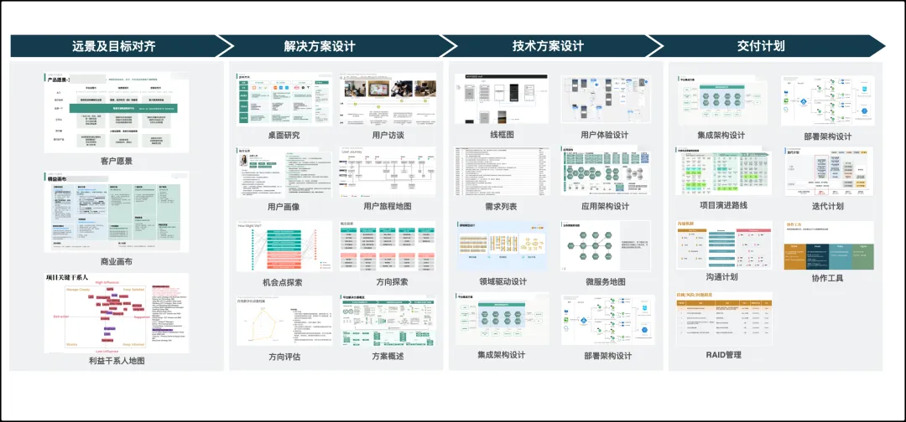
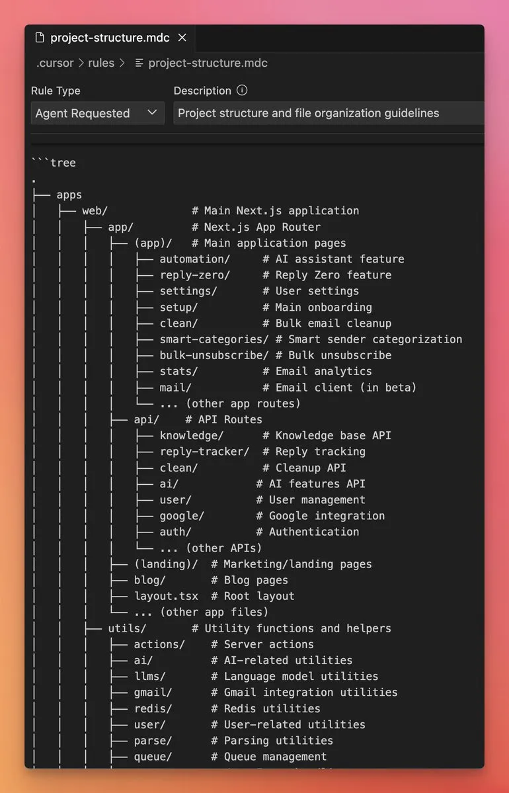

# Cursor实践

## 全面规划

### 开发前的全面规划
开始一个新项目时，我们往往急于写代码，却忽略了前期规划的重要性。在实际项目中，投入时间进行充分的需求梳理和架构设计，通常能显著减少后期的返工时间，避免项目偏离方向。

你可以使用 Cursor 协助生成项目文档，包括功能规划、数据模型和 API 接口定义。这些文档不仅帮助团队成员理解项目全貌，也能作为 AI 理解项目的重要上下文。将这些文档保存为 .md 文件，放在项目的 /docs 目录下，方便团队随时查阅和更新。



### 建立代码基础
从已有基础开始构建往往比从零开始效率更高。使用脚手架工具生成初始的代码框架，再通过 Cursor 进行优化和完善。这种"先搭框架，后填细节"的方法有助于提高代码质量、降低维护成本，让团队更专注于实现业务价值。

你可以在完成完成基础框架后，让 AI 帮你直接生成项目结构图，后续让 AI 遵守。
 


-------------------------
## Cursor开发提示词
### 开发场景提示词模板

**1. 代码生成**
- 功能描述: "我需要一个{具体功能}的实现,使用{编程语言}"
- 技术要求: "请使用{具体框架/库},遵循{设计模式/规范}"
- 输入输出: "输入是{数据格式},需要输出{预期结果}"

**2. 代码优化**
- 性能优化: "请帮我优化这段代码的性能,重点关注{具体方面}"
- 重构建议: "这段代码如何重构更符合{设计原则}"
- 代码审查: "请检查这段代码的潜在问题,包括{安全/性能/可维护性}"

**3. 问题诊断**
- 错误分析: "这段代码报错{具体错误},请帮我分析原因"
- 性能分析: "代码运行较慢,请帮我找出瓶颈"
- 最佳实践: "这个实现是否符合{领域}的最佳实践"

**4. 需求分析与提示词管理**
- 需求拆解: "请帮我分析{具体需求},拆分为可执行的任务"
- 技术选型: "针对{具体场景},推荐合适的技术栈和架构"
- 提示词版本: "基于{需求版本},更新相关提示词"

### 提示词工程最佳实践：Cursor提示词目录结构设计 (Python协作项目)

#### 推荐目录结构

```
prompts/
│
├── core/                     # 核心通用提示词
│   ├── standards.md          # 代码标准与规范
│   ├── architecture.md       # 项目架构描述
│   └── workflows.md          # 工作流程指南
│
├── modules/                  # 按模块分类
│   ├── auth/                 # 认证模块
│   ├── data_processing/      # 数据处理
│   └── api/                  # API相关
│
├── tasks/                    # 按任务类型
│   ├── debugging.md          # 调试提示词
│   ├── refactoring.md        # 重构提示词
│   ├── testing.md            # 测试提示词
│   └── documentation.md      # 文档生成
│
├── team/                     # 团队成员专用
│   ├── alice/                # 个人提示词集
│   ├── bob/                  # 个人提示词集
│   └── shared/               # 团队共享
│
├── libraries/                # 框架与库专用
│   ├── django.md             # Django相关
│   ├── fastapi.md            # FastAPI相关
│   ├── pandas.md             # 数据分析
│   └── pytest.md             # 测试框架
│
├── templates/                # 提示词模板
│   ├── feature_prompt.md     # 新功能开发模板
│   ├── review_prompt.md      # 代码审查模板
│   └── bugfix_prompt.md      # Bug修复模板
│
└── index.md                  # 提示词目录与使用指南
```

#### 设计原则

##### 1. 模块化与可复用

- **关注点分离**: 按功能域、任务类型分类提示词
- **避免重复**: 通用部分提取到core中，专用部分放在对应目录
- **组合使用**: 设计为可组合的小模块，而非大型整体提示词

##### 2. 团队协作优化

- **个人/团队分离**: team目录允许个人风格与团队标准并存
- **明确共享边界**: shared目录存放团队认可的高质量提示词
- **模板标准化**: templates确保团队使用相同提示词结构

##### 3. Python开发特化

- **库与框架专属**: 针对常用Python库的特定提示词
- **测试驱动设计**: 专门提供pytest/unittest提示词
- **风格指南整合**: 整合PEP8等Python规范到标准中

##### 4. 版本控制友好

- **文件粒度适中**: 每个提示词文件聚焦单一主题，方便版本管理
- **Markdown格式**: 纯文本便于diff和合并
- **变更历史**: 在文档头部记录重要变更

#### 使用方法

##### 在Cursor中引用

```python
# 使用@语法引用提示词文件
@prompts/core/standards.md 请按照我们的代码规范重构此函数
```

##### 组合使用

```python
# 组合多个提示词文件
@prompts/core/architecture.md
@prompts/modules/auth/models.md

请实现一个符合我们架构设计的用户认证模块
```

##### 提示词模板示例

```markdown
### 功能开发提示词 (feature_prompt.md)

#### 上下文
模块: {module_name}
功能: {feature_description}
依赖: {dependencies}

#### 架构约束
@prompts/core/architecture.md

#### 实现要求
- 符合PEP8代码规范
- 包含完整单元测试
- 实现以下功能点:
  * {requirement_1}
  * {requirement_2}

#### 预期输出
- 完整的实现代码
- 测试用例
- 简要文档说明
```

采用这种结构化的提示词管理方式，可以显著提升多人协作的Python项目开发效率和一致性。


### 最佳实践示例
**1. 代码生成最佳实践**
- 使用 GitHub Copilot 文档作为参考
https://docs.github.com/en/copilot
- 参考 OpenAI Cookbook 示例
https://github.com/openai/openai-cookbook

**2. 代码优化最佳实践**
- Google 工程实践文档
https://google.github.io/eng-practices/
- Clean Code 原则
https://github.com/ryanmcdermott/clean-code-javascript

**3. 问题诊断最佳实践**
- Stack Overflow 问题诊断指南
https://stackoverflow.com/help/how-to-ask
- Microsoft 开发者文档
https://docs.microsoft.com/en-us/troubleshoot/

**4. AI 辅助开发资源**
- Cursor.sh 官方博客
https://cursor.sh/blog
- Anthropic Claude 最佳实践
https://www.anthropic.com/index/claude-tips-and-tricks

**5. 代码审查指南**
- Google Code Review 指南
https://google.github.io/eng-practices/review/
- 微软 Code Review 清单
https://docs.microsoft.com/en-us/azure/devops/learn/devops-at-microsoft/code-reviews-best-practices

**6. 开发工具链**
- VS Code 扩展推荐
https://marketplace.visualstudio.com/
- JetBrains AI Assistant 指南
https://www.jetbrains.com/help/idea/ai-assistant.html

**7. 编程语言特定实践**
- Python: Real Python 教程
https://realpython.com/
- JavaScript: MDN Web Docs
https://developer.mozilla.org/


-----------------------
## 用图或原型让Cursor更好的理解需求
### 使用图形和原型辅助需求理解

**1. 流程图和示意图**
- 使用Mermaid语法绘制流程图展示业务流程
- 通过PlantUML描述系统架构和组件关系
- 利用Draw.io等工具制作清晰的业务流程图
- 结合时序图说明交互逻辑和数据流向

**2. 界面原型和布局**
- 使用Figma/Sketch制作交互原型
- 通过ASCII art简单描述界面布局
- 提供关键界面的截图或设计稿
- 标注重要的交互点和数据展示区域

**3. 数据结构和模型**
- 使用ER图展示数据关系
- 通过类图描述对象模型
- 提供示例数据和格式说明
- 标注字段类型和验证规则

**4. 最佳实践**
- 图形应简洁清晰,突出重点
- 添加必要的文字说明和注解
- 使用统一的图形语言和符号
- 保持版本一致性和及时更新
- 结合文字描述相互补充
- 按功能模块分类组织图形资源

**5. 使用技巧**
- 先用简单草图快速沟通想法
- 逐步细化和完善关键细节
- 保持图形的可维护性和复用性
- 建立图形资源库便于查阅
- 结合代码注释引用相关图形
- 通过版本控制管理图形资源

**6. 注意事项**
- 避免过于复杂的图形表达
- 及时更新过时的图形说明
- 确保图形格式兼容性
- 注意信息安全和敏感数据
- 统一图形风格和命名规范
- 建立评审和反馈机制


-----------------------
## Cursor Rules 概述
Cursor Rules 是一组用于指导 AI 编程助手行为的规则和提示词。通过设置合适的规则，可以让 AI 更好地理解开发者意图并提供更精准的帮助。

### 参考
Cursor Rules 最佳实践总结
Cursor Rules 进阶指南：打造企业级多语言开发规范

### 核心要素
- 明确任务目标和范围
- 指定代码风格和规范
- 定义输出格式要求
- 设置上下文和约束条件

### 最佳实践

**1. 任务描述清晰化**
- 使用简洁明确的语言
- 将复杂任务拆分为子任务
- 提供具体的示例和期望结果

**2. 上下文信息完整化**
- 提供相关代码片段和文件
- 说明代码所在的项目背景
- 解释特定的业务规则和约束

**3. 交互方式优化**
- 采用渐进式对话
- 及时提供反馈和修正
- 保持对话的连贯性

**4. 输出规范标准化**
- 统一代码风格和命名规范
- 要求添加必要的注释说明
- 指定代码组织和格式要求

### 推荐的 Cursor Rules 资源

**1. 官方资源**
- Cursor 官方文档
https://cursor.directory/rules

- Cursor GitHub 仓库示例
- Cursor 社区最佳实践分享

**2. 第三方资源**
- Awesome Cursor Rules (GitHub)
https://github.com/PatrickJS/awesome-cursorrules

- Cursor Rules Generator
- AI Prompts Collection

**3. 学习平台**
- Cursor Academy
- AI Programming Forums
- Developer Communities

### 使用技巧

**1. 规则模板化**
- 建立常用规则模板库
- 根据场景快速调用
- 持续优化和迭代规则

**2. 效果验证**
- 测试规则执行结果
- 收集反馈并改进
- 建立评估指标体系

**3. 团队协作**
- 共享有效的规则集
- 统一团队使用规范
- 建立最佳实践库


---------
## notepads
### 作用
- 临时记录代码片段、想法和待办事项
- 在不同文件间快速切换和复制粘贴
- 作为草稿空间,避免污染正式代码

### 使用场景
- 重构时临时存放待移动的代码
- 记录调试过程中的关键信息
- 收集多处代码片段进行对比
- 暂存未确定位置的新代码

### 最佳实践
- 使用多个notepads分类管理不同类型的内容
- 定期清理过期内容,保持整洁
- 重要内容及时转移到正式文档
- 添加注释说明代码来源和用途

### 进阶用法

**1. 多窗口协同**
- 左右分屏显示notepad和代码文件
- 上下分屏对比不同版本代码
- 多个notepad窗口并排展示相关代码片段

**2. 智能组织**
- 使用分隔符(如 ===== 或 ------)划分不同内容块
- 添加标题和标签便于快速定位
- 按功能模块或优先级分类存放

**3. 临时工作区**
- 作为代码重构的中转站
- 存放待review的代码片段
- 记录debug过程的关键步骤和发现
- 收集待整理的技术笔记

**4. 协作共享**
- 团队成员间分享代码片段
- 记录pair programming的讨论要点
- 存放code review的反馈意见

**5. 版本管理**
- 保存关键代码的历史版本
- 记录重要修改的前后对比
- 存档实验性代码供后续参考

### 使用建议

**1. 内容管理**
- 定期清理过期或已完成的内容
- 为重要内容添加时间戳和说明注释
- 将成熟代码及时迁移到正式文件
- 避免存放敏感信息和密钥

**2. 效率提升**
- 使用快捷键快速切换notepad
- 善用查找功能定位历史内容
- 建立个人常用代码片段库
- 配合git stash暂存工作内容

**3. 注意事项**
- notepad内容不会自动保存，需要手动保存
- 重要内容及时备份到本地文件
- 避免在notepad中直接运行未经测试的代码
- 保持良好的内容组织习惯

### 产品开发的提示词是否适合notepad
- 不建议放入notepad的原因:
  - 提示词需要长期维护和迭代
  - 涉及产品规划和设计规范,应该有专门的文档管理
  - 团队需要共享和协作,notepad不适合多人编辑
  - 提示词有结构化的组织需求,notepad不便于管理
  
- 更合适的存放位置:
  - 专门的提示词管理文档(如Markdown)
  - 产品设计规范库
  - 知识管理平台
  - 团队协作工具(如Confluence)

---------
## Cursor大模型选择的建议以及Thinking模式选择的建议

### 大模型选择建议

**1. 代码开发场景**
- 使用Claude-3-Opus或GPT-4进行复杂代码生成和重构
- 使用Claude-3-Sonnet进行日常代码编写和调试
- 使用GPT-3.5进行简单代码补全和格式化

**2. 文档写作场景**
- 使用Claude-3-Opus进行专业技术文档撰写
- 使用GPT-4进行长文档结构规划和内容生成
- 使用Claude-3-Sonnet进行文档校对和润色

**3. 创意构思场景**
- 使用Claude-3-Opus进行深度头脑风暴和方案设计
- 使用GPT-4进行多角度分析和创意发散
- 使用Claude-3-Sonnet进行快速想法验证

### Thinking模式选择建议

**1. Fast模式适用场景**
- 简单代码补全和修复
- 快速文本润色和格式调整
- 基础问题咨询和解答
- 需要快速响应的场景

**2. Smart模式适用场景**
- 复杂代码生成和重构
- 技术方案设计和评估
- 深度问题分析和解决
- 需要全面思考的场景

**3. 模式切换建议**
- 根据任务复杂度灵活切换
- 时间紧急时优先Fast模式
- 质量要求高时使用Smart模式
- 在对话过程中可动态调整

---------
## Auto-run
### Auto-Run模式介绍

**1. 基本概念**
- Auto-Run是Cursor的自动运行模式
- 在编写代码时自动执行并显示结果
- 支持多种编程语言的实时执行
- 可以快速验证代码片段的正确性

**2. 主要功能**
- 实时代码执行和结果预览
- 自动检测语法错误
- 支持变量和状态监控
- 交互式调试能力

**3. 适用场景**
- 算法验证和调试
- 数据处理和转换
- API接口测试
- 小型脚本开发
- 学习和教学演示

### Auto-Run最佳实践

**1. 代码组织**
- 将代码分解为小的可测试单元
- 使用清晰的变量命名和注释
- 避免过于复杂的依赖关系
- 保持代码片段的独立性

**2. 性能优化**
- 控制代码执行时间
- 避免无限循环和死锁
- 及时清理临时变量和资源
- 注意内存使用效率

**3. 调试技巧**
- 使用print语句输出关键信息
- 设置断点进行单步调试
- 监控重要变量的变化
- 及时处理异常情况

**4. 使用建议**
- 在开发初期启用Auto-Run快速验证想法
- 复杂项目建议关闭以提高编辑器性能
- 结合版本控制保存重要代码版本
- 定期清理测试代码和临时文件

**5. 注意事项**
- 避免在Auto-Run中执行危险操作
- 注意保护敏感数据和密钥
- 控制资源占用和网络请求
- 保持良好的错误处理习惯


---------
## git

---------

## 文件格式选择适合AI交互的格式

### 为什么需要选择适合AI交互的格式
- 结构化数据便于AI解析和理解
- 文本格式方便版本控制和比对
- 人类可读性好,便于人工审核和修改
- 跨平台兼容性强,不依赖特定软件
- 田攀：适合直接生成PPT :-)

### 适合AI交互的格式及特点

**文档类**
- Markdown: 轻量级标记语言,结构清晰,易读易写
- RST/AsciiDoc: 类似Markdown的文档格式,支持更丰富的格式控制

**数据类**
- JSON: 结构化数据格式,层次清晰,广泛应用于API
- YAML: 相比JSON更简洁易读,适合配置文件
- CSV/TSV: 表格数据存储格式,便于数据分析处理

**图形类** 
- SVG: 矢量图形格式,基于XML,支持程序化生成和修改
- Mermaid: 文本描述生成流程图等图形,便于版本控制
- PlantUML: 用于绘制UML图,文本描述转图形

### 不适合AI处理的格式
- Word/PDF: 二进制格式,结构复杂,难以解析
- 图片格式(JPG/PNG): 像素数据,缺乏语义信息
- 专有软件格式: 依赖特定软件,格式规范不开放
- 复杂排版格式: 样式与内容混杂,增加解析难度


