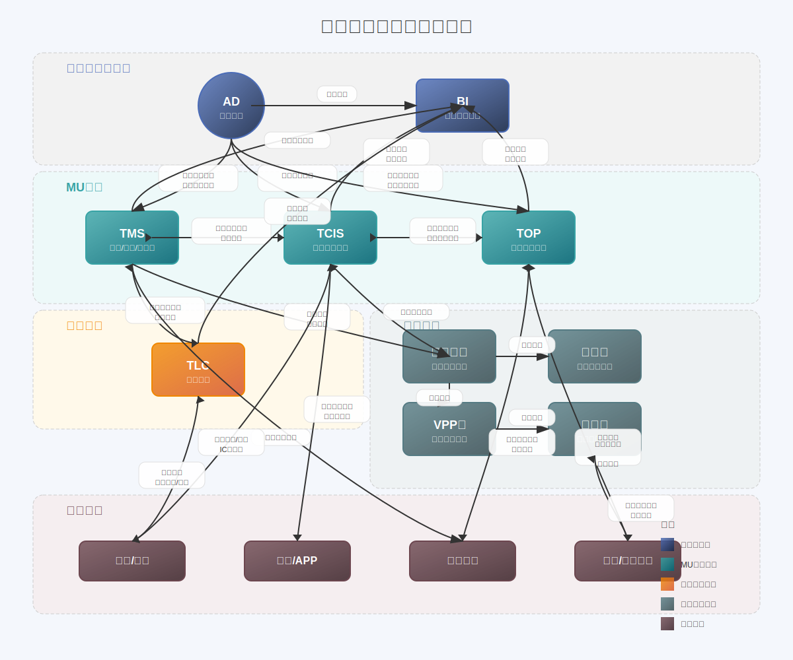
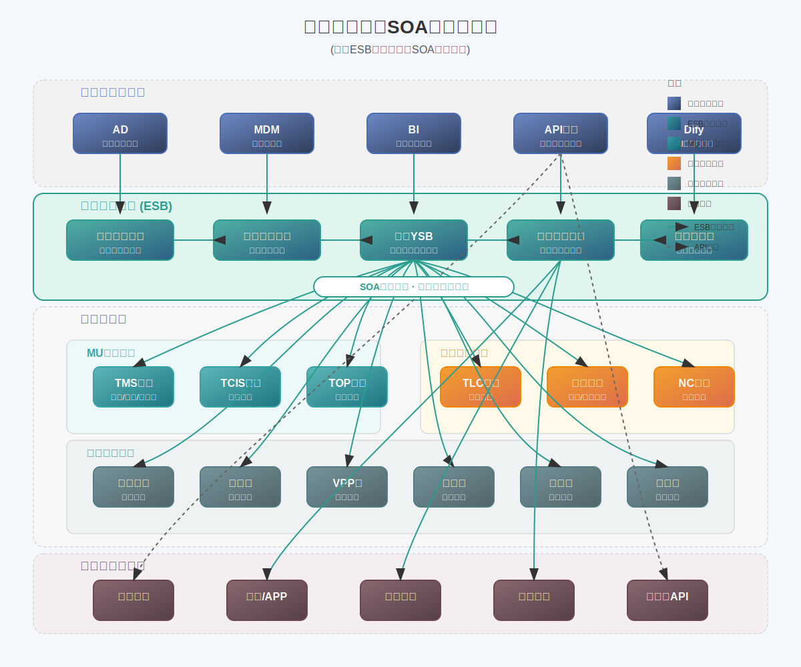
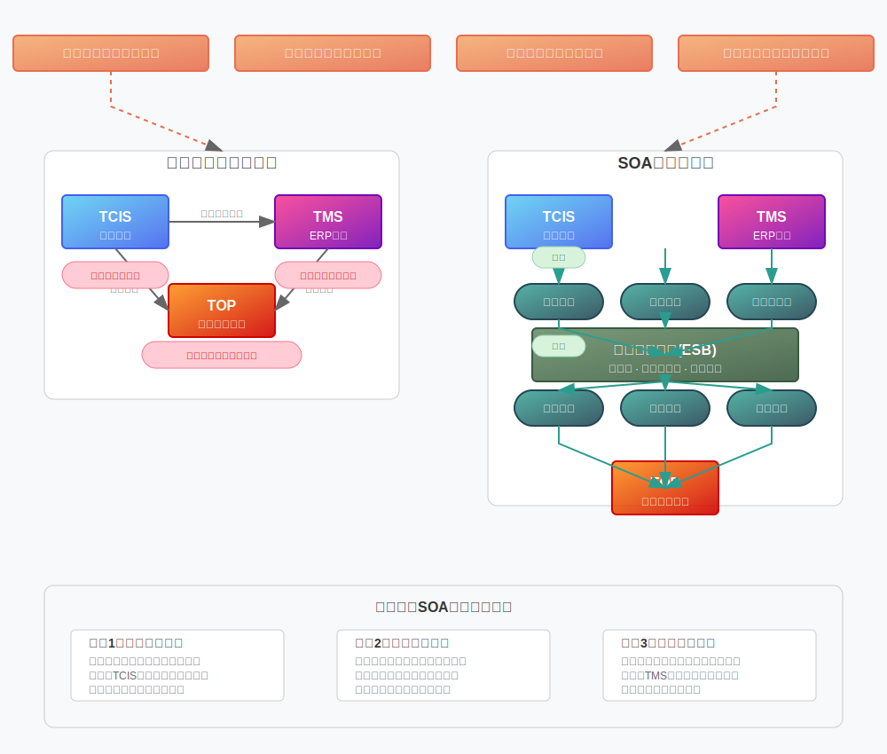

# 港华集团技术架构总体规划

## 1. 总体架构愿景

**核心定位**：技术赋能业务，构建数智化支撑平台，实现降本增效与安全生产。

**战略原则**：
- 业务驱动、技术赋能
- 标准统一、灵活多变
- 安全可靠、持续演进

## 2. 技术架构体系

### 2.1 开发平台

**核心策略**：

----------------

### 2.2 集成架构

**当前港华集成架构图**

- 紧耦合，难维护
- 重复开发，难扩展
- 系统变更影响其他系统

**SOA服务化架构**

**核心目标**：服务共享、标准统一、可视监控

**SOA架构的好处**

1. 服务复用与标准化
   - 避免重复开发,提高开发效率
   - 统一服务标准,降低维护成本
   - 实现服务共享,提升资源利用率

2. 业务灵活性与扩展性
   - 松耦合架构,便于业务变更
   - 服务接口标准化,内部实现可独立变更
   - 服务粒度合理,业务功能解耦

3. 集中化管理与监控
   - 统一服务治理,提升运维效率
   - 全局性能监控,及时发现问题

4. 系统整合与协同
   - 打破系统孤岛,促进数据共享
   - 规范服务接口,简化系统对接

**集成原则**
1. 必须通过ESB集成的场景:
   - 跨系统的核心业务流程集成
   - 高频调用的共享服务接口
   - 需要统一监控和治理的关键接口
   - 涉及主数据同步的接口
   - 跨板块业务协同的接口

2. 可以不经过ESB直接集成的场景:
   - 系统内部模块间的调用
   - 低频次、简单的点对点集成

3. ESB集成优先级:
   - P0: 主数据同步相关接口
   - P1: 核心业务流程接口
   - P2: 高频共享服务接口
   - P3: 其他业务协同接口

**主要策略**：
- 构建企业服务总线(ESB)，基于用友YSB平台
- 采用API网关管理对外服务
- 建立集成服务目录与标准

**点对点集成梳理方法**：

1. 梳理现有集成点及数据流向
2. 按业务域归类整合
3. 识别高频服务，优先迁移至ESB

-----------------------

### 2.3 数据架构

**核心定位**：主数据作为企业经营核心要素，业财融合与板块协同的纽带

**主数据管理策略**：
- 集团级/跨板块主数据统一管理
- 基于用友BIP MDM平台构建主数据治理体系
- 明确主数据权威源与数据责任人

**数据域管理**：
- 基础域：科目、组织、员工、账号
- 业务域：客户、项目、物料、供应商

### 2.4 身份认证架构(IAM)

**核心理念**：基于HR系统的账号全生命周期管理

**主要策略**：
- 采用竹云IAM平台，替代现有AD管理平台
- 实现账号申请、变更、注销全流程自动化
- 集成多因素认证(MFA)和单点登录(SSO)

### 2.5 AI与智能化架构

**核心定位**：AI赋能业务，实现降本增效

**主要策略**：
- 基于Dify平台构建集团智能体生态系统
- 建立业务场景库，推动AI应用标准化
- 构建AI模型评估与管理机制

**应用场景**：
- 生产安全预警与智能分析
- 客户服务智能化
- 运营管理辅助决策

### 2.6 RPA自动化架构

**核心定位**：流程自动化，解放人力资源

**主要策略**：
- 流程梳理先行，技术实现后续
- 标准化场景优先实施
- 与AI技术结合，实现智能自动化

### 2.7 门户架构（Web门户和移动门户）

**核心定位**：统一入口、一体化体验、跨平台协同

**门户平台选型考虑要点**：

**主要策略**：
- 构建统一门户平台，打造企业数字化服务枢纽
- Web端与移动端协同设计，实现多端一致体验
- 基于微前端架构，支持业务组件灵活组合

**门户体系规划**：
- 员工门户：整合OA、HR自助、内部应用入口
- 业务门户：生产运营管理、安全管理等专业应用
- 客户门户：提供客户自助服务与互动功能
- 伙伴门户：面向供应商与合作伙伴的协同平台

**技术选型原则**：
- 统一技术栈，降低维护成本
- 组件化设计，提高复用率
- 响应式布局，适配多种终端设备

## 3. 组织与人才体系

**核心原则**：业务引领，技术支撑，协同创新

**组织架构优化**：
- 集团信息中心统筹规划，板块IT团队业务支撑
- 构建数字化转型办公室，协调跨部门项目
- 建立技术专家委员会，提供技术决策支持

**人才发展策略**：
- 培养"T型"人才，既懂技术又懂业务
- 建立技术认证体系与晋升通道
- 加强外部合作与知识引进

## 4. 制度与流程体系

**核心定位**：制度保障落地，流程提升效率

**关键制度建设**：
- 技术标准与规范管理制度
- 项目管理与交付质量保障制度
- 数据安全与隐私保护制度

**流程优化策略**：
- 需求管理流程标准化
- 开发交付流程敏捷化
- 运维服务流程ITIL化

## 5. 实施路线图

**核心策略**：分阶段、持续迭代、价值优先

**五年规划**：

| 阶段 | 时间范围 | 主要目标 |
|-----|---------|---------|
| 第一阶段 | 1年内 | 基础平台建设，解决关键痛点 |
| 第二阶段 | 2-3年 | 能力提升，扩展应用场景 |
| 第三阶段 | 4-5年 | 全面整合，构建数智化生态 |

**优先项目**：
1. IAM平台建设与账号生命周期管理
2. 企业服务总线(ESB)构建
3. 主数据管理平台实施
4. AI智能体平台扩展

## 6. 风险与挑战

**核心策略**：风险前置，持续监控，灵活应对

**主要风险点**：
- 多系统整合与数据一致性挑战
- 新旧技术切换风险
- 人才储备与能力建设不足

**应对措施**：
- 建立完善的变更管理与测试体系
- 培养内部技术专家团队
- 强化与供应商战略合作

## 7. 价值与评估

**核心定位**：技术投入产出可衡量、可评估

**评估维度**：
- 业务价值：降本增效、安全生产指标改善
- 技术价值：系统可用性、集成效率、安全性提升
- 组织价值：IT响应速度、用户满意度

**评估机制**：
- 建立IT价值评估体系
- 定期组织架构评审与优化
- 持续收集业务部门反馈
